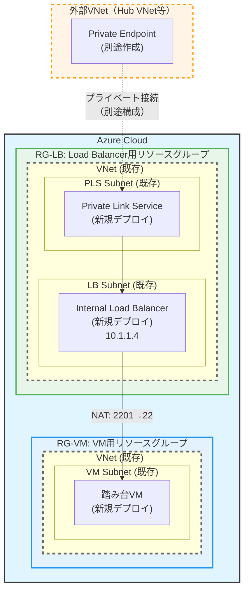

# Azure 踏み台VM + Private Link + Internal Load Balancer 構成（既存VNet版）

既存のVNet・Subnetを利用して、同一VNet内に Internal Load Balancer、Private Link Service、踏み台VMを配置し、Private Link Service経由で外部VNetからセキュアにSSH接続するためのアーキテクチャです。

---

## 目次

1. [概要](#概要)
2. [新規VNet版との違い](#新規vnet版との違い)
3. [アーキテクチャ図](#アーキテクチャ図)
4. [前提条件](#前提条件)
5. [コンポーネント詳細](#コンポーネント詳細)
6. [デプロイ手順](#デプロイ手順)
7. [トラブルシューティング](#トラブルシューティング)

---

## 概要

### 設計目標

- **既存VNetを活用**: 新たにVNetを作成せず、既存のネットワークインフラを利用
- **Subnet自動作成**: 必要なSubnetを自動的に作成
- **同一VNet構成**: LB、Private Link Service、VMを同一VNet内の別Subnetに配置
- 外部VNetから Azure 踏み台VMへの**完全プライベート接続**（Private Link Service経由）
- 踏み台VMへの**単一エントリポイント**（Internal Load Balancer経由）

### 適用シナリオ

このバージョンは以下のケースに最適です：

1. **既存ネットワーク環境への追加**: 既にVNetが構築済みの環境
2. **VNet設計が確定済み**: VNetアドレス範囲が既に完了（Subnetは自動作成）
3. **同一VNet内での構成**: LB、PLS、VMを同一VNet内に集約したい場合
4. **最小限の変更**: 既存VNetに影響を与えず、Subnetとリソースのみをデプロイ

---

## 新規VNet版との違い

| 項目 | 新規VNet版 (`main.bicep`) | 既存VNet版 (`main.bicep`) |
|------|-------------------------|--------------------------------------|
| **VNet作成** | 新規作成 | 既存VNetを利用 |
| **Subnet作成** | 新規作成 | 新規作成 |
| **Load Balancer** | Public LB（インターネット経由） | Internal LB（プライベート） |
| **Private Link Service** | なし | あり（外部VNet接続用） |
| **NSG** | 新規作成 | 新規作成 |
| **パラメータ** | VNetアドレス範囲を指定 | VNetリソースID + Subnet CIDR範囲を指定 |
| **デプロイ対象** | VNet + Public LB + VM | Subnet + NSG + ILB + PLS + VM |
| **適用環境** | 新規環境、検証環境 | 既存環境、本番環境 |

---

## アーキテクチャ図

### 全体構成



**凡例:**
- 実線枠: 新規デプロイされるリソース
- 破線枠: 既存のリソースまたは別途構成が必要なリソース

**注意:**
- このテンプレートでは Private Endpoint は含まれません
- Private Endpoint は外部VNet（Hub VNet等）から別途作成してください
- LB、PLS、VMは同一VNet内の異なるSubnetに配置されます

---

## 前提条件

### 既存リソース要件

以下のリソースが**事前に構築済み**である必要があります：

#### 1. VNet
- 既存のVNetが必要です
- VNetには新規Subnet作成に必要な十分なアドレス空間が必要です
- 推奨: 最低3つの /24 Subnet分のアドレス空間（例: /16 VNet）

**注意:**
- Subnetは自動的に作成されます（事前作成不要）
- NSGも自動的に作成されます

#### 2. その他
- Azure CLI (`az`) インストール済み
- Bicep CLI インストール済み
- Azure サブスクリプションへのContributor以上の権限

---

## コンポーネント詳細

### デプロイされるリソース

| リソース | 種類 | 配置先 | 詳細 |
|---------|------|--------|------|
| Subnet × 3 | Microsoft.Network/virtualNetworks/subnets | 既存VNet | LB用、PLS用、VM用 |
| NSG × 3 | Microsoft.Network/networkSecurityGroups | RG-LB, RG-VM | LB用、PLS用、VM用 |
| Internal Load Balancer | Microsoft.Network/loadBalancers | RG-LB | Standard SKU、NAT Rules設定 |
| Private Link Service | Microsoft.Network/privateLinkServices | RG-LB | ILBのフロントエンドを公開 |
| 踏み台VM (1台) | Microsoft.Compute/virtualMachines | RG-VM | Ubuntu 22.04 LTS、パスワード認証 |

**注意:**
- SSHキーは含まれません。デプロイ後にAzure Portalから追加してください
- Private Endpointは含まれません。外部VNetから接続する場合は別途作成してください
- VNetは既存のものを利用します（新規作成しません）

### 既存リソースの参照とSubnet作成

Bicepテンプレートでは、以下のように既存VNetを参照し、新規Subnetを作成します：

```bicep
// パラメータで既存VNet情報を受け取る
param vnetResourceGroup string
param vnetName string
param lbSubnetPrefix string

// 既存VNetを参照
resource vnet 'Microsoft.Network/virtualNetworks@2023-11-01' existing = {
  name: vnetName
  scope: resourceGroup(vnetResourceGroup)
}

// 新規Subnetを作成
resource subnet 'Microsoft.Network/virtualNetworks/subnets@2023-11-01' = {
  name: 'snet-lb'
  parent: vnet
  properties: {
    addressPrefix: lbSubnetPrefix
  }
}
```

---

## デプロイ手順

### 1. 既存VNetの情報を取得

既存のVNetのリソースIDとアドレス空間を確認します。

```bash
# VNet リソースID
az network vnet show \
  --resource-group <VNET_RG_NAME> \
  --vnet-name <VNET_NAME> \
  --query id -o tsv

# VNet アドレス空間の確認
az network vnet show \
  --resource-group <VNET_RG_NAME> \
  --vnet-name <VNET_NAME> \
  --query addressSpace.addressPrefixes -o table

# 既存Subnetの確認（未使用のアドレス範囲を特定）
az network vnet subnet list \
  --resource-group <VNET_RG_NAME> \
  --vnet-name <VNET_NAME> \
  --query "[].{Name:name, AddressPrefix:addressPrefix}" -o table
```

### 2. パラメータファイルの編集

`bicep/parameters/main.parameters.json` を編集します：

```json
{
  "vnetId": {
    "value": "/subscriptions/<SUBSCRIPTION_ID>/resourceGroups/<VNET_RG_NAME>/providers/Microsoft.Network/virtualNetworks/<VNET_NAME>"
  },
  "vnetResourceGroup": {
    "value": "<VNET_RG_NAME>"
  },
  "vnetName": {
    "value": "<VNET_NAME>"
  },
  "lbSubnetPrefix": {
    "value": "10.1.1.0/24"
  },
  "plsSubnetPrefix": {
    "value": "10.1.2.0/24"
  },
  "vmSubnetPrefix": {
    "value": "10.1.3.0/24"
  },
  "ilbPrivateIp": {
    "value": "10.1.1.4"
  },
  "adminUsername": {
    "value": "azureuser"
  },
  "adminPassword": {
    "value": "YourSecurePassword123!"
  }
}
```

**重要パラメータ:**
- `vnetId` / `vnetResourceGroup` / `vnetName`: 既存VNetの情報
- `lbSubnetPrefix` / `plsSubnetPrefix` / `vmSubnetPrefix`: 新規作成するSubnetのCIDR範囲（既存Subnetと重複しない範囲）
- `ilbPrivateIp`: Internal Load BalancerのプライベートIP（lbSubnetPrefix内のIPアドレス）
- `adminPassword`: 最低12文字、大文字・小文字・数字・記号を含む必要があります

### 3. デプロイスクリプトの実行

```bash
cd scripts
chmod +x deploy-existing-vnet.sh
./deploy-existing-vnet.sh
```

スクリプトは以下を実行します：

1. 前提条件チェック
2. パラメータファイル検証
3. 既存リソース確認
4. what-if検証（オプション）
5. デプロイ実行
6. SSH接続方法案内

### 4. 接続確認

#### 同一VNet内からの接続

```bash
# 同一VNet内のVMやリソースから
ssh azureuser@10.1.1.4 -p 2201
```

#### 外部VNetからの接続（Private Endpoint経由）

外部VNetから接続する場合は、以下の手順でPrivate Endpointを作成してください：

1. デプロイ出力から Private Link Service Alias を取得
2. 外部VNet（Hub VNet等）に Private Endpoint を作成

```bash
# PLS Alias の取得
az deployment sub show \
  --name <DEPLOYMENT_NAME> \
  --query properties.outputs.plsAlias.value -o tsv

# Private Endpoint の作成（外部VNetから実行）
az network private-endpoint create \
  --resource-group <HUB_RG_NAME> \
  --name pe-bastion \
  --vnet-name <HUB_VNET_NAME> \
  --subnet <HUB_SUBNET_NAME> \
  --private-connection-resource-id <PLS_RESOURCE_ID> \
  --connection-name conn-bastion \
  --manual-request true \
  --request-message "Connection from Hub VNet"
```

### 5. Private Link接続の承認

Private Endpoint作成後、接続を承認します：

```bash
az network private-endpoint-connection approve \
  --name <connection-name> \
  --resource-name pls-bastion \
  --resource-group rg-lb-bastion \
  --type Microsoft.Network/privateLinkServices \
  --description "Approved for onpremise access"
```

---

## トラブルシューティング

### 問題: Subnet not found エラー

**原因:**
- パラメータファイルのSubnetリソースIDが間違っている
- 指定したSubnetが存在しない

**対処:**
```bash
# リソースIDの形式を確認
az network vnet subnet show \
  --resource-group <RG_NAME> \
  --vnet-name <VNET_NAME> \
  --name <SUBNET_NAME> \
  --query id -o tsv
```

### 問題: Private Link Service の Subnet で NetworkPolicies エラー

**原因:**
- PLS SubnetでPrivate Link Service用のネットワークポリシーが有効になっている

**対処:**
```bash
# ネットワークポリシーを無効化
az network vnet subnet update \
  --resource-group <RG_NAME> \
  --vnet-name <VNET_NAME> \
  --name snet-pls \
  --disable-private-link-service-network-policies true
```

### 問題: NSG との競合

既存のNSGルールが通信をブロックしている可能性があります。

**対処:**
```bash
# 有効なNSGルールを確認
az network nic show-effective-nsg \
  --name <VM_NIC_NAME> \
  --resource-group rg-vm-bastion

# 必要に応じてNSGルールを追加
az network nsg rule create \
  --resource-group <RG_NAME> \
  --nsg-name <NSG_NAME> \
  --name Allow-SSH-from-ILB \
  --priority 100 \
  --source-address-prefixes "10.1.1.0/24" \
  --destination-port-ranges 22 \
  --access Allow \
  --protocol Tcp
```

---

## 参考リンク

- [既存リソースの参照 (Bicep)](https://learn.microsoft.com/azure/azure-resource-manager/bicep/existing-resource)
- [Private Link Service のネットワークポリシー](https://learn.microsoft.com/azure/private-link/disable-private-link-service-network-policy)
- [Azure Load Balancer のトラブルシューティング](https://learn.microsoft.com/azure/load-balancer/load-balancer-troubleshoot)
- [Azure Private Link Service](https://learn.microsoft.com/azure/private-link/private-link-service-overview)

---

## 変更履歴

| 日付 | 変更内容 | 作成者 |
|------|---------|--------|
| 2025-10-17 | 同一VNet構成に変更（PE削除、VNet Peering削除、1台VM固定） | - |
| 2025-10-16 | 初版作成（既存VNet版） | - |
