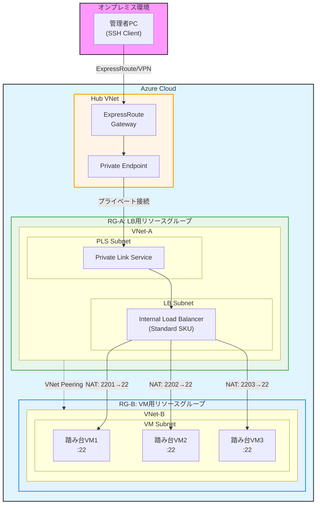
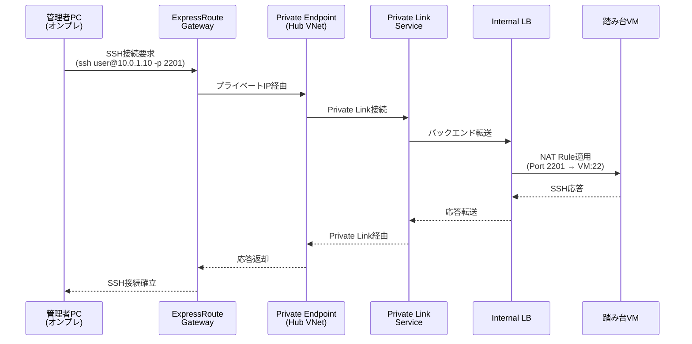

# Azure 踏み台VM + Private Link + Internal Load Balancer 構成

オンプレミス環境から Azure 内の複数踏み台VMに対して、Private Link Service経由でセキュアにSSH接続するためのアーキテクチャです。

---

## 目次

1. [概要](#概要)
2. [アーキテクチャ図](#アーキテクチャ図)
3. [コンポーネント詳細](#コンポーネント詳細)
4. [ネットワークフロー](#ネットワークフロー)
5. [NAT Rules ポートマッピング](#nat-rules-ポートマッピング)
6. [セキュリティ設計](#セキュリティ設計)
7. [デプロイ手順](#デプロイ手順)
8. [トラブルシューティング](#トラブルシューティング)

---

## 概要

### 設計目標

- オンプレミスから Azure 踏み台VMへの**完全プライベート接続**（インターネット非経由）
- 複数踏み台VMへの**単一エントリポイント**（Private Link Service経由）
- 異なるリソースグループ・VNet間での**柔軟なリソース配置**
- **Azure Bastion非採用**（ローカルからの直接SSH接続要件のため）

### 主要技術スタック

- **ExpressRoute / VPN Gateway**: オンプレミス接続
- **Private Link Service**: サービスプライベート公開
- **Internal Load Balancer (Standard)**: 内部負荷分散 + NAT Rules
- **VNet Peering**: 異なるVNet間のプライベート通信
- **Linux VM**: Ubuntu踏み台サーバー

---

## アーキテクチャ図

### 全体構成



### データフロー詳細



---

## コンポーネント詳細

### 1. Hub VNet（既存想定）

| 項目 | 値 |
|------|-----|
| 用途 | オンプレミス接続用ハブVNet |
| 接続方法 | ExpressRoute または VPN Gateway |
| Private Endpoint配置 | あり（Private Link Service接続用） |
| 想定アドレス範囲 | 10.0.0.0/16 |

### 2. RG-A / VNet-A（LB用）

| リソース | 種類 | 詳細 |
|---------|------|------|
| VNet-A | Virtual Network | アドレス範囲: 10.1.0.0/16 |
| LB Subnet | Subnet | 10.1.1.0/24（ILB配置用） |
| PLS Subnet | Subnet | 10.1.2.0/24（Private Link Service用） |
| Internal LB | Load Balancer | Standard SKU、プライベートIP: 10.1.1.4 |
| Private Link Service | Private Link Service | ILBのフロントエンドIPを公開 |

### 3. RG-B / VNet-B（VM用）

| リソース | 種類 | 詳細 |
|---------|------|------|
| VNet-B | Virtual Network | アドレス範囲: 10.2.0.0/16 |
| VM Subnet | Subnet | 10.2.1.0/24（踏み台VM配置用） |
| 踏み台VM1-N | Virtual Machine | Ubuntu 22.04 LTS、Standard_B2s |
| NSG | Network Security Group | SSH (22) 許可ルール |

### 4. VNet Peering

| 方向 | 設定 |
|------|------|
| VNet-A → VNet-B | 許可、リモートゲートウェイ使用なし |
| VNet-B → VNet-A | 許可、リモートゲートウェイ使用なし |

---

## ネットワークフロー

### SSH接続フロー（例: VM1へ接続）

```
オンプレ管理者PC
  ↓ ssh azureuser@<Private-Endpoint-IP> -p 2201
ExpressRoute Gateway (Hub VNet)
  ↓
Private Endpoint (Hub VNet内: 10.0.1.10)
  ↓ (Private Link接続)
Private Link Service (VNet-A)
  ↓
Internal Load Balancer (VNet-A: 10.1.1.4)
  ↓ NAT Inbound Rule: 2201 → 22
  ↓ (VNet Peering経由)
踏み台VM1 (VNet-B: 10.2.1.4:22)
  ↓
VNet-B内の各種リソース（アプリケーションサーバー等）
```

---

## NAT Rules ポートマッピング

Internal Load Balancerの**Inbound NAT Rules**により、単一エントリポイントから複数VMへポート分散します。

| ILB ポート | 転送先VM | VMポート | 用途 |
|-----------|---------|---------|------|
| 2201 | 踏み台VM1 (10.2.1.4) | 22 | SSH接続 |
| 2202 | 踏み台VM2 (10.2.1.5) | 22 | SSH接続 |
| 2203 | 踏み台VM3 (10.2.1.6) | 22 | SSH接続 |

### 接続例

```bash
# VM1に接続
ssh azureuser@<Private-Endpoint-IP> -p 2201

# VM2に接続
ssh azureuser@<Private-Endpoint-IP> -p 2202

# VM3に接続
ssh azureuser@<Private-Endpoint-IP> -p 2203
```

---

## セキュリティ設計

### Network Security Group (NSG) ルール

#### VM Subnet用 NSG

| 優先度 | 名前 | 方向 | ソース | 宛先 | プロトコル | ポート | アクション |
|-------|------|------|--------|------|----------|--------|----------|
| 100 | Allow-SSH-from-ILB | Inbound | 10.1.1.0/24 (LB Subnet) | * | TCP | 22 | Allow |
| 200 | Deny-All-Inbound | Inbound | * | * | * | * | Deny |
| 100 | Allow-All-Outbound | Outbound | * | * | * | * | Allow |

#### Private Link Service Subnet用 NSG

| 優先度 | 名前 | 方向 | ソース | 宛先 | プロトコル | ポート | アクション |
|-------|------|------|--------|------|----------|--------|----------|
| 100 | Allow-PrivateLink | Inbound | * | * | * | * | Allow |
| 100 | Allow-All-Outbound | Outbound | * | * | * | * | Allow |

### セキュリティのベストプラクティス

1. **最小権限の原則**
   - NSGでILBサブネットからのSSH (22) のみ許可
   - 不要なポートは全てDeny

2. **プライベート接続のみ**
   - パブリックIPを一切使用しない
   - Private Link Serviceで完全閉域化

3. **監査とロギング**
   - NSG Flow Logsを有効化（推奨）
   - Azure Monitor / Log Analyticsで接続ログ収集

4. **認証強化**
   - SSH公開鍵認証必須（パスワード認証無効化）
   - Azure AD統合（オプション）

---

## デプロイ手順

### 前提条件

- Azure CLI または PowerShell (Az モジュール)
- Bicep CLI (`az bicep install`)
- 適切な権限（Contributor以上）
- Hub VNetが既存であること
- ExpressRoute/VPN接続が確立済みであること

### デプロイコマンド

```bash
# 1. パラメータファイルを編集
vi bicep/parameters/main.parameters.json

# 2. デプロイスクリプト実行
cd scripts
chmod +x deploy.sh
./deploy.sh

# または直接デプロイ
az deployment sub create \
  --location japaneast \
  --template-file bicep/main.bicep \
  --parameters bicep/parameters/main.parameters.json
```

### Private Link Serviceの承認

Private Link Serviceは接続時に**手動承認**が必要な場合があります。

```bash
# Private Link接続を一覧表示
az network private-endpoint-connection list \
  --name <private-link-service-name> \
  --resource-group rg-lb-bastion \
  --type Microsoft.Network/privateLinkServices

# 接続を承認
az network private-endpoint-connection approve \
  --name <connection-name> \
  --resource-name <private-link-service-name> \
  --resource-group rg-lb-bastion \
  --type Microsoft.Network/privateLinkServices \
  --description "Approved for onpremise access"
```

---

## トラブルシューティング

### 問題: SSH接続がタイムアウトする

**確認ポイント:**

1. **Private Endpointの状態確認**
   ```bash
   az network private-endpoint show \
     --name pe-bastion-pls \
     --resource-group rg-hub
   ```
   - `provisioningState` が `Succeeded` であること
   - `privateLinkServiceConnections.privateLinkServiceConnectionState.status` が `Approved` であること

2. **NSG設定確認**
   ```bash
   # NSGの有効ルールを確認
   az network nic show-effective-nsg \
     --name <vm-nic-name> \
     --resource-group rg-vm-bastion
   ```

3. **VNet Peering状態確認**
   ```bash
   az network vnet peering show \
     --name vnet-a-to-vnet-b \
     --resource-group rg-lb-bastion \
     --vnet-name vnet-lb
   ```
   - `peeringState` が `Connected` であること

4. **Load Balancer NAT Rulesの確認**
   ```bash
   az network lb inbound-nat-rule list \
     --lb-name ilb-bastion \
     --resource-group rg-lb-bastion
   ```

### 問題: Private Link接続が `Pending` のまま

**対処:**

Private Link Serviceの接続を手動承認する必要があります。

```bash
az network private-endpoint-connection approve \
  --name <connection-name> \
  --resource-name pls-bastion \
  --resource-group rg-lb-bastion \
  --type Microsoft.Network/privateLinkServices
```

### 問題: VM間通信ができない

**確認ポイント:**

1. **VNet Peeringの双方向設定**
   - VNet-A → VNet-B と VNet-B → VNet-A の両方が `Connected` であること

2. **ルートテーブル確認**
   ```bash
   az network nic show-effective-route-table \
     --name <vm-nic-name> \
     --resource-group rg-vm-bastion
   ```

3. **NSGでVNet間通信が許可されているか**

---

## 参考リンク

- [Azure Private Link とは](https://learn.microsoft.com/azure/private-link/private-link-overview)
- [Private Link Service の作成](https://learn.microsoft.com/azure/private-link/create-private-link-service-portal)
- [Azure Load Balancer の NAT Rules](https://learn.microsoft.com/azure/load-balancer/load-balancer-inbound-nat-rules)
- [VNet ピアリングについて](https://learn.microsoft.com/azure/virtual-network/virtual-network-peering-overview)
- [Azure Bicep のドキュメント](https://learn.microsoft.com/azure/azure-resource-manager/bicep/)

---

## 変更履歴

| 日付 | 変更内容 | 作成者 |
|------|---------|--------|
| 2025-10-16 | 初版作成 | - |
